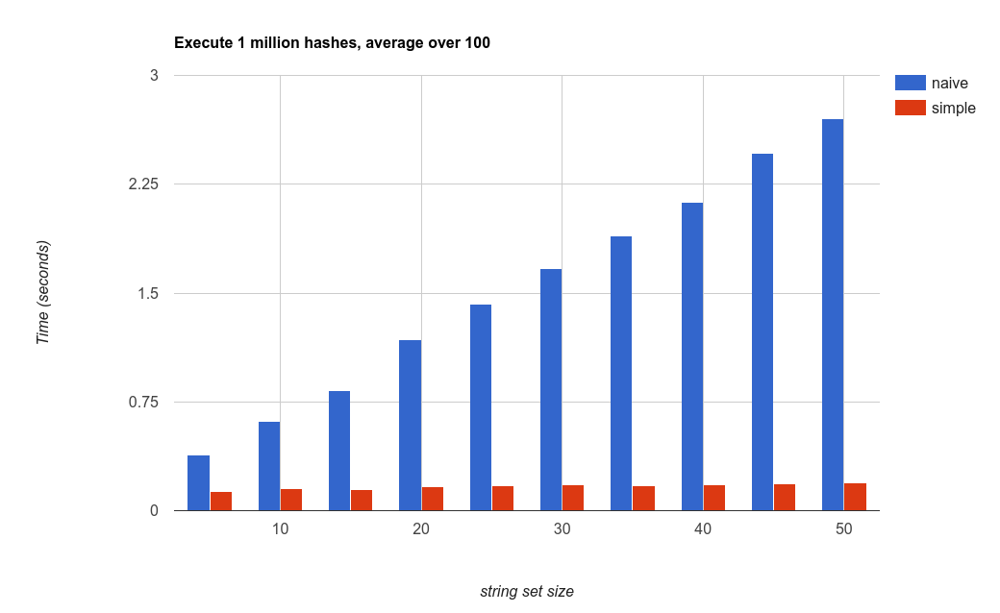

<!-- $theme: gaia -->

# Practical (?) Applications of Reflection

<figure>

</figure>


Jackie Kay
C++ Now
May 18th, 2017
jackieokay.com

<div align="right">
<br>
<br>
<br>
<font size="4">
"Narcissus", Caravaggio, circa 1597–1599
&nbsp; &nbsp; &nbsp;
</font>
</div>

---
<!-- page_number: true -->

<div align="center">

</div>
	
<font size="4">Alternative title image: "Metamorphosis of Narcissus", Salvador Dalí, 1937</font>

---
# What is reflection?

---

# Start not with the solution, but the problem.

---
# A problem

Code duplication due to hardcoding knowledge about the layout of a type.

```c++
struct Box    { Point pos; float length; float width; };
struct Circle { Point pos; float radius; };

// Primitive shapes defined by rendering library
void draw(const Box&);
void draw(const Circle&);

template<typename T>
void draw(const T& shape) {
  // We know T is composed of only boxes and circles.
  // But how do we know how to access them?
}
```

---
One solution is costly at runtime:

```c++
struct CompositeShape {
  std::vector<Box> boxes;
  std::vector<Circle> circles;
};

void draw(const CompositeShape& shape) {
  for (const auto& box : shape.boxes) {
    draw(box);
  }
  for (const auto& circle : shape.circle) {
    draw(circle);
  }
}
```

---
Another solution is costly for programmer time:

```c++
struct Capsule {
  std::array<Circle, 2> ends;
  Box middle;
};

void draw(const Capsule& shape) {
  for (const auto& circle : shape.ends) {
    draw(circle);
  }
  draw(shape.middle);
}

// Imagine writing this for hundreds of objects
// Now imagine maintaining it
```

---

How about an API that gets all the members for a generic type?

```
// Ideal syntax

template<typename T>
void draw(const T& shape) {
  for... (auto& member : reflect(shape).members()) {
    if constexpr (member.drawable()) {
      draw(member);
    }
  }
}
```

---

# Let's call this "introspection".

---

### C++ solutions

- Schema-based code generation
  - Cap'n Proto
- Compiler tooling
  - siplasplas
- "Adapt struct" macros
  - Fusion, Hana
- Arcane secrets
  - POD Flat Reflection (formerly magic_get)

---
# Cap'n Proto

C++ code is generated from a schema:
```
struct Person {
  name @0 :Text;
  age  @1 :UInt32;
}
```
becomes
```c++
// name @1 :Text;
::capnp::Text::Reader getName();
// age @0 :Int32;
int32_t getAge();
```

---
# siplasplas

Generate compile-time reflection info with libclang

```
class Foo { int i; };
// generates in a separate header:
template<>
class Class<Foo> {
public:
    using Fields = typelist<Field<SourceInfo<
                string<'i'>,                     // name
                string<'f', 'o', 'o', '.', 'h'>, // file
                4                                // line
            >,
            decltype(&Foo::i), &Foo::i, // Pointer
        >>;
};
```

---
# Adapt struct macros
Example lifted from [Boost Hana documentation](boostorg.github.io/hana):
```c++
struct Person {
  BOOST_HANA_DEFINE_STRUCT(Person,
    (std::string, name),
    (std::string, last_name),
    (int, age));
};
// or, if Person is externally defined
BOOST_HANA_ADAPT_STRUCT(Person, name, last_name, age);

```
---
# Adapt struct macros
```c++
Person presenter{"Jackie", "Kay", 24};
hana::for_each(presenter, [](auto pair) {
  std::cout << hana::to<char const*>(hana::first(pair))
            << ": " << hana::second(pair) << std::endl;
});
// name: Jackie
// last_name: Kay
// age: 24
```
---

# How does it work?
- For each member, the macro:
- Generates generic set and get functions
- Stringizes the field name into constexpr string
- Uses the identifier name and type to get the member pointer
- Associates this into tuple of constexpr string, member pointer accessor pairs.
- Template specialization required for 1 member, 2 members, ... up to N members

---
# POD Flat Reflection (pfr)

```c++
template<size_t I, typename T>
void print_members_recursive(const T& t) {
  if constexpr (I == pfr::tuple_size<T>{}) {
    return;
  } else {
    std::cout << pfr::flat_get<I>(t) << "\n";
    print_members_recursive<I + 1>(t);
  }
}
struct Person {
  const char* name;
  const char* last_name;
  int age;
};
Person presenter{"Jackie", "Kay", 24};
print_members_recursive<0>(presenter);
```

---
# How does it work?
- C++17 version uses structured bindings and no macros
- That sounds much better... right?

---

```c++
// full namespaces and noexcept omitted for brevity
template <class T>
constexpr auto as_tuple_impl(T&& /*val*/, size_t_<0>) {
  return sequence_tuple::tuple<>{};
}

template <class T>
constexpr auto as_tuple_impl(T&& val, size_t_<1>) {
  auto& [a] = std::forward<T>(val);
  return detail::make_tuple_of_references(a);
}

template <class T>
constexpr auto as_tuple_impl(T&& val, size_t_<2>) {
  auto& [a,b] = std::forward<T>(val);
  return detail::make_tuple_of_references(a,b);
}

// etc...
```
---

```c++
template <class T>
constexpr auto as_tuple_impl(T&& val, size_t_<100>) {
  auto& [
    a,b,c,d,e,f,g,h,j,k,l,m,n,p,q,r,s,t,u,v,w,x,y,z,A,B,C,
    D,E,F,G,H,J,K,L,M,N,P,Q,R,S,T,U,V,W,X,Y,Z,aa,ab,ac,ad,
    ae,af,ag,ah,aj,ak,al,am,an,ap,aq,ar,as,at,au,av,aw,ax,
    ay,az,aA,aB,aC,aD,aE,aF,aG,aH,aJ,aK,aL,aM,aN,aP,aQ,aR,
    aS,aT,aU,aV,aW,aX,aY,aZ,ba,bb,bc,bd
  ] = std::forward<T>(val);

  return detail::make_tuple_of_references(
    a,b,c,d,e,f,g,h,j,k,l,m,n,p,q,r,s,t,u,v,w,x,y,z,A,B,C,
    D,E,F,G,H,J,K,L,M,N,P,Q,R,S,T,U,V,W,X,Y,Z,aa,ab,ac,ad,
    ae,af,ag,ah,aj,ak,al,am,an,ap,aq,ar,as,at,au,av,aw,ax,
    ay,az,aA,aB,aC,aD,aE,aF,aG,aH,aJ,aK,aL,aM,aN,aP,aQ,aR,
    aS,aT,aU,aV,aW,aX,aY,aZ,ba,bb,bc,bd
  );
}
```

---

# Other languages

- Python
  - Flexible and powerful, user-friendly syntax
- Java
  - Extensive runtime API
- C\#
  - Runtime introspection API
  - Can "compile" and instantiate code at runtime

---
# D
[`__traits`](https://dlang.org/spec/traits.html) provides `allMembers`, `getOverloads`, even `compiles`

Also: the powers of [`mixin`](https://dlang.org/mixin.html):
```D
template GenStruct(string Name, string M1)
{
    const char[] GenStruct = "struct "
        ~ Name ~ "{ int " ~ M1 ~ "; }";
}

mixin(GenStruct!("Foo", "bar"));
// ...
writeln(f.bar);
```

---

# Proposed solutions for C++

---

# reflexpr
- [P0194R3](http://www.open-std.org/jtc1/sc22/wg21/docs/papers/2017/p0194r3.html) by Matúš Chochlík and Axel Naumann
- I recommend P0578R0, ["Static Reflection in a Nutshell"](http://www.open-std.org/jtc1/sc22/wg21/docs/papers/2017/p0578r0.html) by Chochlík, Naumann and David Sankel
- [Clang implementation](https://github.com/matus-chochlik/clang/tree/reflexpr) and [documentation](http://matus-chochlik.github.io/mirror/doc/html/index.html)

---

# reflexpr: raw API

```
namespace meta = std::meta;
using MetaInfo = reflexpr(Person);
std::cout << "A " << meta::get_base_name_v<MetaInfo>
          << " is made up of "
          << meta::get_size<MetaInfo> << " things.\n";
```

---

# operator$/cpp3k
- [P0590R0](http://www.open-std.org/jtc1/sc22/wg21/docs/papers/2017/p0590r0.pdf) by Andrew Sutton and Herb Sutter
- [Clang implementation](https://github.com/asutton/clang-reflect) also available
- Choice of $ is controversional: supported as valid identifier as an extension in most compilers
  - But there's more to it than just the symbol

---
# operator$

```c++
namespace meta = cpp3k::meta::v1;
constexpr auto info = $Person;
std::cout << "A " << info.name() << " is made up of "
          << info.member_variables().size()
          << " things.\n";
```

---

# Which API is better?

---

# Well, let's figure out how we want to use it first!

---

# Warm-up: equality operators

```
template<typename T>
bool equal(const T& a, const T& b) {
  if constexpr (equality_comparable<T>()) {
    return a == b;
  } else if constexpr (iterable<T>()) {
    if (a.size() != b.size()) {
      return false;
    }
    for (int i = 0; i < a.size(); ++i) {
      if (!equal(a[i], b[i])) return false;
    }
    return true;
  } else { /* Time for reflection */ }
}
```

---
# With reflexpr

```c++
using MetaT = reflexpr(T);
static_assert(meta::Record<MetaT>,
  "Reached non-equality comparable leaf member.");
bool result = true;
meta::for_each<meta::get_data_members_m<MetaT>>(
  [&a, &b, &result](auto&& member) {
    using M = typename std::decay_t<decltype(member)>;
    constexpr auto p = meta::get_pointer<M>::value;
    result = result && equal(a.*p, b.*p);
  }
);
return result;
```

---
# With cpp3k

```c++
static_assert(refl::is_member_type<T>(),
  "Reached non-equality comparable leaf member.");
bool result = true;
meta::for_each($T.member_variables(),
  [&a, &b, &result](auto&& member){
    constexpr auto p = member.pointer();
    result = result && equal(a.*p, b.*p);
  }
);
return result;
```

---

# Observations

- Using types to represent metainfo values has more syntactic overhead, especially when using lambdas
- for_each requires valid initial state of result, doesn't allow early return/short circuting
- What about private vs. public members?

---

# Fold expressions

reflexpr can express sequences as parameter packs:

```c++
template<typename ...Pack>
struct compare_fold {
  static constexpr auto apply(const T& a, const T& b) {
    return (equal(a.*pointer<Pack>(), b.*pointer<Pack>())
            && ...);
  }
};
// ...
meta::unpack_sequence_t<meta::get_data_members_m<MetaT>,
    compare_fold>::apply(a, b);
```

Can probably optimize better than for_each

---

# Access specifiers

- `reflexpr` offers `get_data_members`, `get_public_data_members`, and `is_public/private` for individual member metainfo
- `cpp3k` provides `is_public/private` but no convenience function for all public members

---

# Bypassing private is easier*

```c++
class A { int x = 42; };
struct B {
  int y;
  B(const A& a) {
    y = a.*meta::get_pointer<
      meta::get_element_m<
        meta::get_data_members_m<reflexpr(A)>, 0
      >>::value;
  }
};
// ...
A a;
assert(B(a).y == 42);
```

<sub>*see blog post by [Johannes Schaub](http://bloglitb.blogspot.co.uk/2011/12/access-to-private-members-safer.html)</sub>

---

# My 2¢ on access specifiers

- Access specifiers are already "broken" in the language. They're still useful for interface design.
- Guideline: prefer to reflect on public data members for serialization, etc. and hide implementation details in private members, to avoid breaking compatibility between versions
- Standardized API should include a convenience accessor for public member variables, to encourage this guideline

---

# Serialization/deserialization

---

# JSON deserialization

Louis Dionne's Meeting C++ 2016 keynote showed a JSON serializer using a value-semantics metaprogramming mini-library built on top of `reflexpr`.

How about deserialization?

```c++
template<typename T>
auto deserialize(std::string_view& src, T& dst);
```

Requires matching a runtime string to a metainfo.

---
# Linear matching

```c++
// input: string_view representing the string to parse
// parsed_keys: all key strings for a JSON object
// result: error code (gets returned out of deserialize)
for (const auto& key : parsed_keys) {
  const auto& value = parse_next_value(input);
  meta::for_each($T.member_variables(),
    [&dst, &key, &value, &result](auto&& m) {
      if (key == m.name()) {
        if (result = deserialize(value, dst.*m.pointer());
            result != deserialize_result::success) {
          return;
        }
      }
    }
  );
}
```

---

# Observations

- Same pattern of recursively applying an operation over all members of a struct as the equality operator example.
- String matching could be costly at runtime: if T has n members, O(n) string comparisons per JSON key.

--- 

# Program options

---

# Program options: interface

Struct member name corresponds to command line flag and abbreviation.

```c++
struct ProgramOptions {
  std::string filename;  // --filename, -f
  int iterations = 100;  // --iterations, -i
  bool help = false;     // --help, -h
  float foo;             // --foo, -o
};

// Returns nullopt if there was a parsing error
template<typename T>
optional<T> parse(int argc, char** argv const);
```

---

# Program options: outline

- Accumulate a Hana compile-time map with pairs: ("--member_name", metainfo)
- Take 'c', the first character in "member_name". If "-c" not in the map, add ("-c", "metainfo"), else check next character.
- `parse` iterates over `argv` and converts a runtime `const char*` to constexpr map key to retrieve metainfo
- Metainfo provides member pointer and type (needed to set member)

---

# Program options: reflexpr

```c++
template<typename T> struct OptionsMap {
  using MetaT = reflexpr(T);
  template<typename... MetaFields>
  struct make_prefix_map {
    static constexpr auto helper() {
      return hana::fold(
        hana::make_tuple(MetaFields{}...),
        hana::make_map(), collect_flags
      );
    }
  };
  static constexpr auto prefix_map =
    meta::unpack_sequence_t<
      meta::get_data_members_m<MetaT>,
      make_prefix_map>::helper();
};
```

---

# Program options: cpp3k

```c++
template<typename T> struct OptionsMap {
  static constexpr auto prefix_map = hana::fold(
    refl::adapt_to_hana($T.member_variables()),
    hana::make_map(),
    collect_flags
  );
};

/* "adapt_to_hana" internals */
template<typename T, size_t ...I>
constexpr auto adapt_to_hana_helper(const T& t,
    std::index_sequence<I...>&&) {
  return hana::make_tuple(
    cpp3k::meta::v1::cget<I>(t)...
  );
}
```

---

# Constexpr string parameters

- `get_base_name_v<reflexpr(T)>` returns a const char[N]
- `$T.name()` returns a `const char*`
- Can't pass these constexpr values to functions and use function parameters in a template context
- `hana::map` string keys must be `hana::string`'s

---
# Stop-gap solution

Pass type of metainfo into a `get_name` function.

```c++
template<typename T, size_t... I>
constexpr auto helper(std::index_sequence<I...>) {
  return hana::string_c<T::name()[I]...>;
}
template<typename T>
constexpr auto get_name() {
  constexpr auto L = static_strlen(T::name());
  return helper<T>(std::make_index_sequence<L>{});
}
// Usage:
using T = std::decay_t<decltype(field)>;
hana::insert(prefix_map,
  hana::make_pair("--"_s + get_name<T>(), field));
```

---
# Parsing and setting members

```c++
auto set(T& opt, const char* prefix, const char* val) {
  hana::for_each(hana::keys(prefix_map),
    [&options, &prefix, &v](const auto& key) {
      if (runtime_string_compare(key, prefix)) {
        constexpr auto info = hana::at_key(prefix_map,
                                           decltype(key));
        constexpr auto p = info.pointer();
        using M = unreflect_member_t<T, decltype(info)>;
        opt.*p = boost::lexical_cast<M>(val, strlen(val));
      }
    }
  );
}
```

---	

# vs. boost::program_options


---

# Observations

- Constexpr strings can be annoying with the current state of the language. We need a standard representation and utilities such as constexpr `strlen` and `strcmp`.
- In order to add metadata such as help strings or custom flags, my ideal syntax is user-defined attributes and reflection on attributes
- Same linear runtime string matching pattern appears. Can we do better?

---

# constexpr string hashing

Idea: exploit our knowledge of the set of all member identifiers at compile time.

Implement a runtime perfect hash from N unique strings to N unique integers (no collisions).

Then match the runtime integer to a compile-time index and a callback.

In our reflection examples, the hash input is a member name, and the hash output is the compile-time index into the struct.

---

# string hash implementation


```c++
template<typename... Strings>
struct simple_string_hash {
  static constexpr auto MaxLength
    = max_string_length(Strings{}...);

  auto operator()(const char* keyword) const {
    unsigned total = strlen(keyword);
    auto max = std::min(total, MaxLength);
    for (unsigned i = 0; i < max; ++i) {
      total += keyword[i] * (i + 1);
    }
    return total;
  }
  // ...
};
```

---

# string hash implementation

```c++
  template<typename StringLiteral, size_t ...I>
  static constexpr auto compute_helper(StringLiteral&&,
      std::index_sequence<I...>) {
    using S = std::decay_t<StringLiteral>;
    return ((S::value().data()[I] * (I + 1)) + ...);
  }

  template<typename StringLiteral>
  static constexpr auto hash(StringLiteral&& literal) {
    using S = std::decay_t<StringLiteral>;
    constexpr auto Length = S::value().size();
    return compute_helper(
        literal, std::make_index_sequence<Length>{})
      + Length;
  }
```
---

# Matching integer sets

Even if string hash was perfect, it's not sequential. Need another mapping.

<div align="center">

</div>

---

# Matching integer sets

```c++
template<typename F, size_t ...Seq>
struct recursive_switch_table {
  using IndexSeq = std::index_sequence<Seq...>;
  template<size_t I, size_t Iterations>
  static auto apply(unsigned i) {
    switch(i) {
      case I:
        constexpr auto ic = map_to_index<I, Seq...>()>{};
        return f(std::integral_constant<size_t, ic>{});
      default:
        constexpr unsigned n = Iterations + 1;
        return apply<sequence_at<n>(IndexSeq{}), n>(i);
    }
  }
  // ... syntactic sugar for apply
};
```

---

# Benchmark

Compare to naive (linear) implementation:
```c++
// F: callback
// StringSet: tuple of string literals
template<typename F, typename StringSet, size_t ...I>
constexpr auto naive_string_hash(F&& f,
    StringSet&& set, std::index_sequence<I...>&&) {
  return [&f, &set](const char* input) {
    ([&set, &input, &f]() {
      if (sl::equal(std::get<I>(string_set), input)) {
        f(std::integral_constant<size_t, I>{});
      }
    }(), ...);
  };
}
```

---


# Results (-O0)



---

# Results (-O3)

<div align="center">

</div>

---

# Caveats/observations

- Number of members in a struct rarely exceeds 10
- Hash is not perfect for all strings from 0 to max-length: exhaustive test finds collisions. Lots of room for improvement
- But, with or without reflection, metaprogramming could become more "practical" with efficient runtime to compile-time mappings


---

# Compile times

- "Alias-based" metaprogramming generally faster than value-based
  - Refer to [metaben.ch](metaben.ch), Odin Holmes's blog and presentation
- Probably the best justification for `reflexpr` style
- priority(human time) > priority(compiler time)? Who decides?
- Is compiler speed a library issue, language issue, or QoI issue?

---

# Shifting gears

---

# Function reflection

Ever written cryptic boilerplate metafunctions to get the arity of a function or an invocable?

```c++
void f(int x, const std::string& name) {
  // ...
}

// ...

constexpr unsigned arity_f = $f.parameters().size();
```

(Note: $ implementation requires name of function, doesn't support lambdas)

---

# Reflection on overload sets
Warning: fictional syntax

```c++
void f(int x) {
  // ...function body...
}
void f(float x) {
  // ...function body...
}
// ...
for... (const auto& overload : $f.overloads()) {
  // "int" in first iteration, "float" in the next
  using ArgT = decltype(overload.parameters()[0])::type;
}
```
But what would the order be?

---

# What's missing?

---

# Introspection is only one piece of the puzzle.

---

# We need the ability to manipulate identifiers at compile-time.

---

# Manipulating identifiers

I'll call this operator `iddecl`, for "identifier declaration".

The idea is sometimes called `idreflexpr`, but I consider this mechanism orthogonal to reflection.

I don't have access to a compiler with it implemented, so let's dream a bit...

---
# "iddecl" example

```c++
struct Person { int age; const char* name; };

template<typename T>
struct A {
  // Fictional syntax:
  // Parameter pack expansion for member declaration
  (get_member_types_m<reflexpr(T)>
      iddecl(get_data_members_m<reflexpr(T)>))...;
};

A<Person> a{24, "jackie"};
std::cout << a.name << " is " << a.age << " years old.\n";
```

---
# "How is this different from inheritance?"

---
# It's better

(where better == more powerful)

```c++
template<typename T>
struct POD {
  (get_member_types_m<reflexpr(T)>
        iddecl(filter<
          get_data_members_m<reflexpr(T)>, is_pod
        >)
  )...;
};
```

---
# Mocking with iddecl

```c++
template<typename T>
struct Mock {
  using MetaT = reflexpr(T);
  (get_member_function_types_m<MetaT>
    iddecl(get_member_functions_m<MetaT>)
      (Args... args)
    {
      // Mock library interface collects 
      return impl<get_member_functions_m<MetaT>>(args...);
    }
  )...;
};
```
---

# How can we improve this syntax?

Refer to [P0633R0](http://www.open-std.org/jtc1/sc22/wg21/docs/papers/2017/p0633r0.pdf), "Exploring the Design Space of metaprogramming and reflection", by Daveed Vandervoorde and Louis Dionne

---
# With $ and constexpr for (on steroids)
```c++
template<typename T>
struct Mock {
  constexpr {
    for...(const auto& function : $T.member_functions()) {
      using Function = decltype(function);
      Function::return_type
      iddecl(function)(Function::arguments&& args) {
        constexpr auto impl = impl_map.at(function);
        return std::apply(impl, args);
      }
    }
  }
};
```
---

# Traits/interfaces ala [dyno](https://github.com/ldionne/dyno)

```c++
struct DrawableInterface {
  virtual void draw(std::ostream& out) = 0;
};

struct Square {
  void draw(std::ostream& out) const { out << "Square"; }
};

// What is concept_map?
using drawable = concept_map<DrawableInterface>;

void f(drawable const& d) {
  d.draw(std::cout);
}
```

---
# Traits/interfaces ala [dyno](https://github.com/ldionne/dyno)

```c++
template<typename I>
struct concept_map {
  constexpr {
    for...(const auto& function : $I.member_functions()) {
      using Function = decltype(function);
      Function::return_type
      iddecl(function)(Function::arguments&& args) {
        return poly_.virtual_(
          stringize(function.name()))(poly, args);
      }
    }
  }
private:
  dyno::poly<Drawable> poly_;
};
```

---

# And other customization points that suck less

Hint: watch Michał Dominiak's presentation

---

# Why is it missing right now?

There's no precedent in the language: can only manipulate identifiers with the preprocessor.

Can we use constexpr strings in an iddecl? How do you refer to the result of an iddecl? If you "clone" another struct's member with iddecl, do you maintain its default value, cv qualifiers, attributes, etc?

We need a strong vision going forward.

---

For that, I'll let this guy take the stage:

<div align=center>

</div>

but you'll have to wait a few more months!

---

# Acknowledgments

This presentation wouldn't exist without:
- Matúš Chochlík, Axel Naumann, and David Sankel for including me in discussions on reflection
- Extra thanks to Matúš for implementing `reflexpr`
- Andrew Sutton for implementing `operator$`
- Louis Dionne for Hana, P0633R0, and string hashing ideas
- Vittorio Romeo for inspiring the program options example, feedback, and moral support

---

# Presentation links

- github.com/jacquelinekay/reflection_experiments
- github.com/jacquelinekay/c++now2017